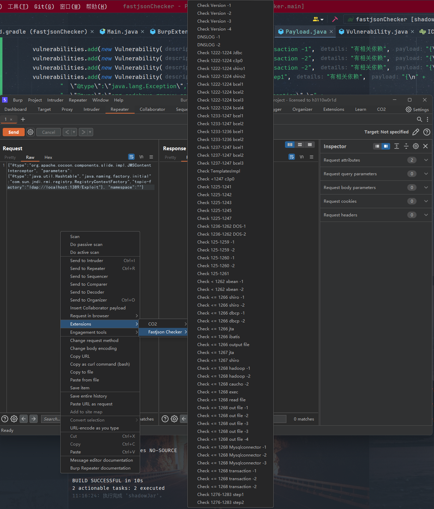

# fastjson Checker
> 一个用于手工检测fastjson反序列化漏洞的burpsuite插件。

## Usage
如图，在需要插入payload的地方右键选择对应payload，即可快速插入payload，相关提示会显示在插件日志中:

## todo
- 拆分多级菜单，优化菜单逻辑，将测试版本、DNSLog、bypasswaf拆分开
- 添加bypasswaf功能，预期是选中一部分json字符串，通过添加大量字符、无效字符、unicode编码等实现
- 优化提示和日志输出、联动burp的dnslog和漏洞输出