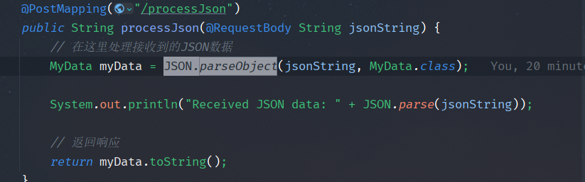
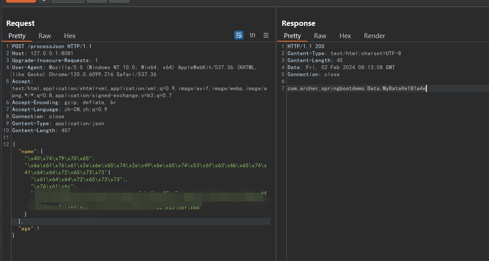
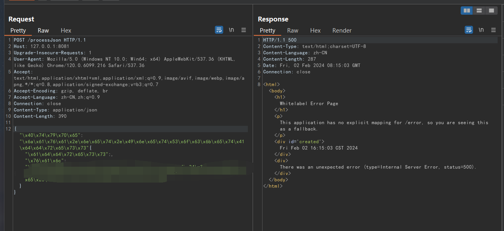
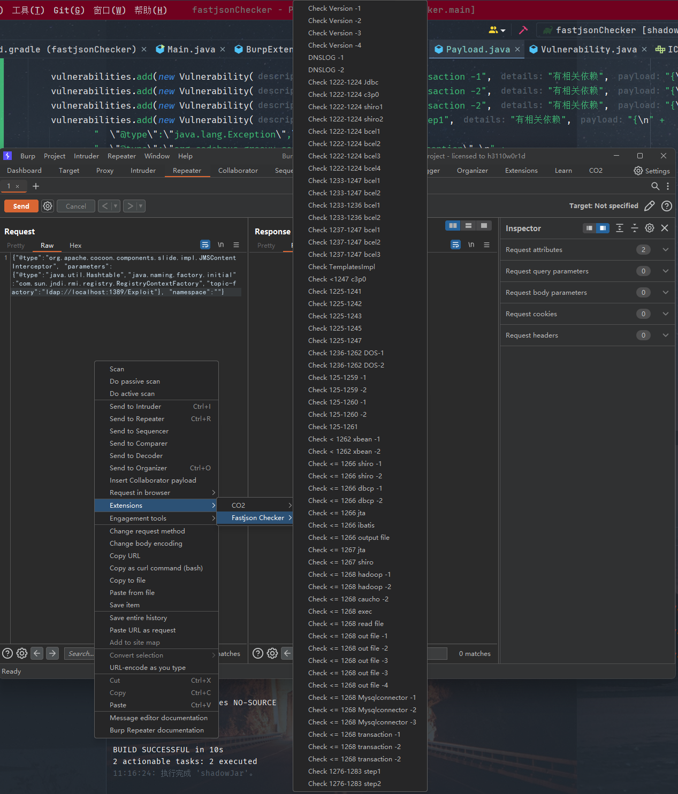
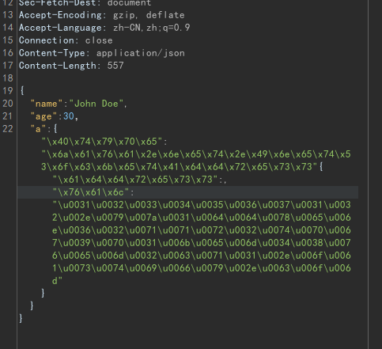

# fastjson Checker
> 一个用于手工检测fastjson反序列化漏洞的burpsuite插件。
## 解决痛点
在JSON.parseObject有对应实现类的情况下进行fastjson的反序列化，没有预设参数可能导致反序列化异常，或者在嵌套json的场景下只有部分位置使用fastjson进行解析：

## Usage
如图，在需要插入payload的地方右键选择对应payload，即可快速插入payload，相关提示会显示在插件日志中，并且支持一些常见的bypass手段:

bypass模块，选中其中一部分，右键指定编码模式，自动将引号内部进行编码

## TODO
- 优化bypasswaf功能，目前只添加了两种编码和随机混合编码，后期继续加入插入无效字符等混合随机模式
- 联动burp的dnslog和漏洞输出

## 参考
- [safe6Sec/Fastjson](https://github.com/safe6Sec/Fastjson)
- [从0开发burpsuite插件（Java）- m01ly](https://m01ly.github.io/2021/05/21/burpsuite-develop/)