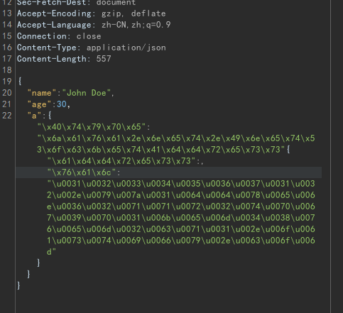

# fastjson Checker
> 一个用于手工检测fastjson反序列化漏洞的burpsuite插件。

## Usage
如图，在需要插入payload的地方右键选择对应payload，即可快速插入payload，相关提示会显示在插件日志中:

bypass模块，选中其中一部分，右键指定编码模式，自动将引号内部进行编码

## TODO
- 优化bypasswaf功能，目前只添加了两种编码，后期希望加入混合编码，插入无效字符等混合随机模式
- 优化提示和日志输出、联动burp的dnslog和漏洞输出
- 测试其他系统下的复制粘贴功能（模拟键盘，目前没测试）

## 参考
[safe6Sec/Fastjson](https://github.com/safe6Sec/Fastjson)
[从0开发burpsuite插件（Java）- m01ly](https://m01ly.github.io/2021/05/21/burpsuite-develop/)